# JobMatch AI

**Smart Chrome Extension for Job Seekers** — Analyze job postings against your resume using AI, get match scores and skill gap analysis, auto-fill applications, generate cover letters, rewrite resume bullets, and track every job you apply to.

[](https://chromewebstore.google.com/detail/jobmatch-ai-%E2%80%93-smart-resum/pfdlaofmcbmjnljfiembdcadcjjnlcia?hl=en-US)


<p align="center">
  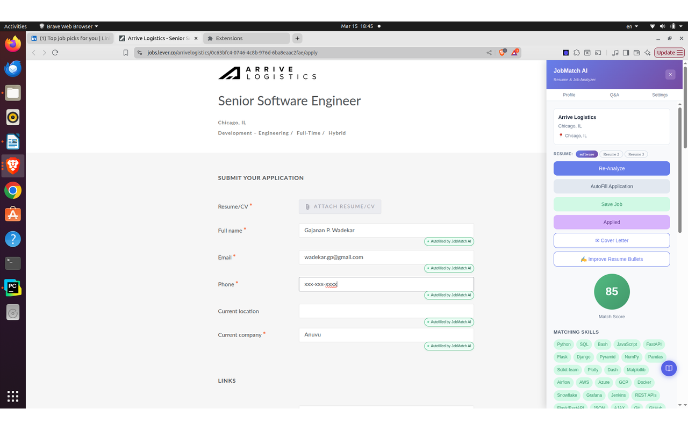
</p>
<p align="center"><em>JobMatch AI open on a job application form — match score, matching skill tags, and teal "✦ Autofilled by JobMatch AI" badges on every completed field.</em></p>

---

## Features

### Resume Analysis & Job Matching

Upload your resume (PDF or DOCX) once. When you visit any job posting, click **Analyze Job** to get a full breakdown in seconds.

<p align="center">
  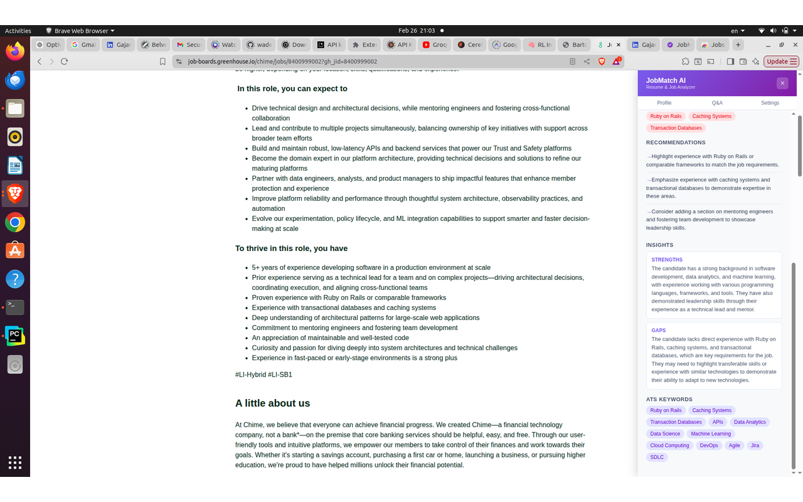
</p>
<p align="center"><em>Analysis panel on a LinkedIn job posting — match score with color indicator, Insights summary, matching skills, missing skills, ATS keywords, and recommendations.</em></p>

- **Match Score** (0–100) with a color-coded indicator
- **Insights** — a written strengths and gaps summary: what makes you a strong candidate and what to address before applying
- **Matching Skills** — skills you already have that the job requires
- **Missing Skills** — gaps to address or highlight differently
- **ATS Keywords** — key terms to include in your resume and application
- **Recommendations** — specific, actionable advice to improve your fit for that role
- Scores are cached per URL with deterministic AI settings so you get a consistent result every session. Click **Re-Analyze** to force a fresh evaluation.

### Smart Auto-Fill

Click **AutoFill Application** and the extension scans every field on the page, sends them to AI along with your resume profile and saved Q&A answers, and prepares a complete set of answers. Before anything is filled, a **chip preview bar** appears at the bottom of the page so you can review each answer inline. Confirm to fill — or edit any answer first.

<p align="center">
  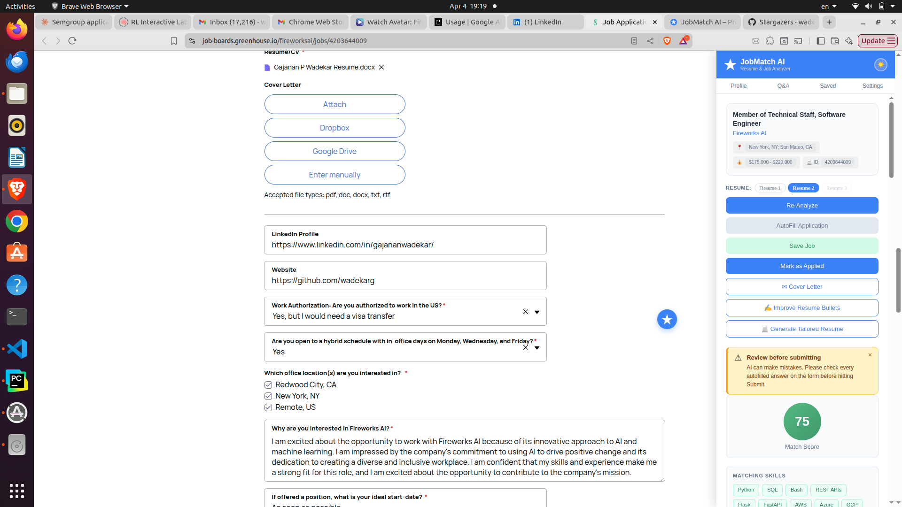
</p>
<p align="center"><em>AutoFill in action on a Greenhouse application — the panel shows your match score and action buttons while form fields are completed using your resume and saved Q&A answers.</em></p>

Works with:
- Standard text inputs and textareas
- Native `<select>` dropdowns
- Custom dropdowns built with React, Angular, or plain JS
- Radio buttons and checkboxes

Every filled field gets a **"✦ Autofilled by JobMatch AI"** teal badge. Always review before submitting.

### Cover Letter Generator

After analyzing a job, click **Cover Letter** in the side panel. A tailored cover letter is generated from the job description and your resume — not a template, a letter written specifically for that role and your background.

<p align="center">
  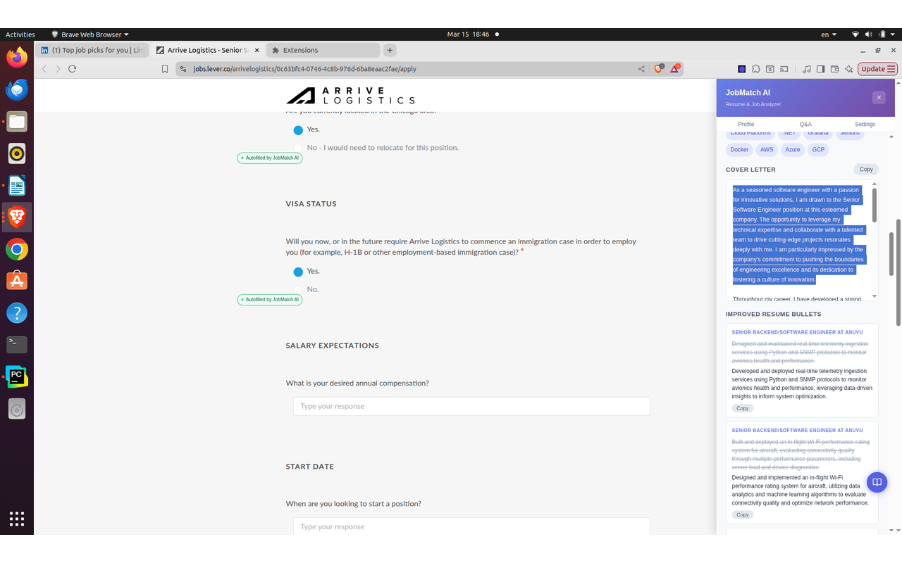
</p>
<p align="center"><em>Cover letter generated from your resume and the job description — ready to copy.</em></p>

### Resume Bullet Rewriter

Click **Improve Resume Bullets** after analyzing a job. The AI rewrites your experience descriptions to match the job's language and close the skill gaps highlighted in the analysis.

<p align="center">
  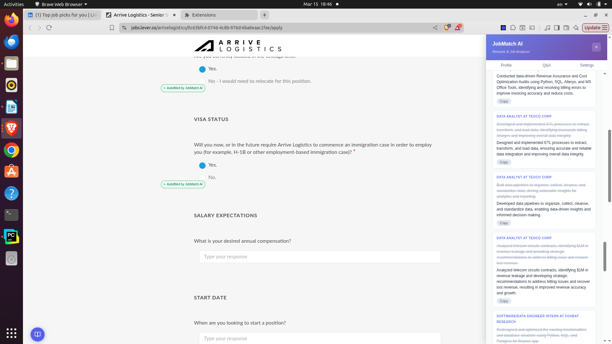
</p>
<p align="center"><em>Rewritten resume bullets — tailored to the job's language and missing skills, ready to paste back into your resume.</em></p>

### Job Notes

Every job posting has a **Notes** section at the bottom of the side panel — a free-text area for your own observations, interview prep, follow-up reminders, or anything else. Notes are saved per URL automatically and persist across sessions.

<p align="center">
  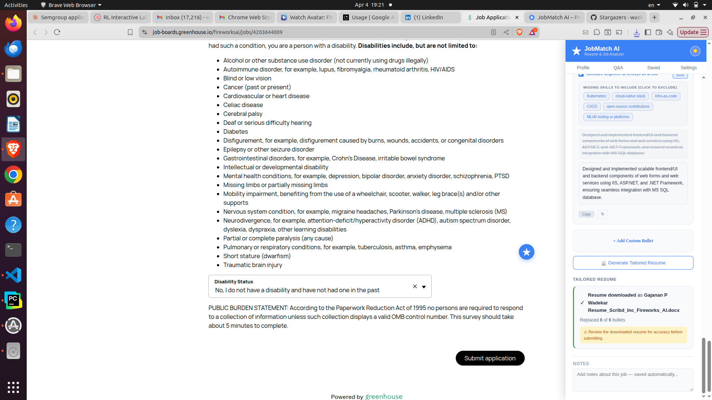
</p>
<p align="center"><em>Notes section at the bottom of the panel — type anything, it saves automatically per job URL.</em></p>

### Three Resume Slots

Store up to **3 resume profiles** and switch between them with one click directly from the side panel. Each slot is independently parsed and stored. Rename any slot to keep them organized (e.g. "Backend Eng", "Data Eng", "Lead").

<p align="center">
  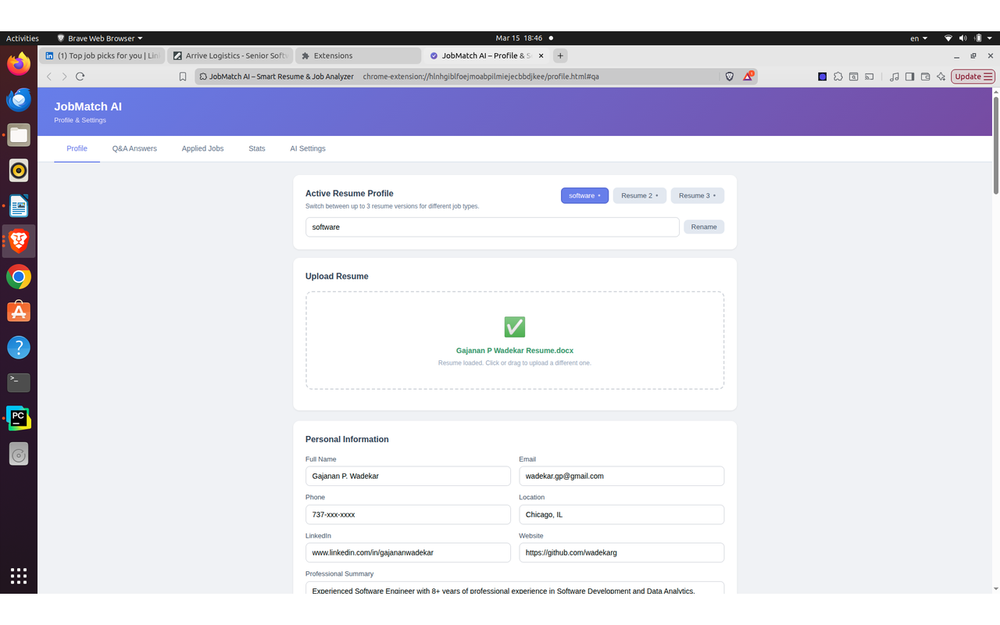
</p>
<p align="center"><em>Profile page — three named resume slots at the top, drag-and-drop upload, and fully parsed profile fields (contact info, summary, skills, experience, education, projects, certifications) with autosave.</em></p>

### Common Q&A Answers

Pre-fill answers to hundreds of standard application questions so AutoFill can complete them without prompting you each time. Covers work authorization, availability, salary expectations, notice period, sponsorship, EEO and demographic fields, and more. Filter by category to quickly find and edit any answer.

<p align="center">
  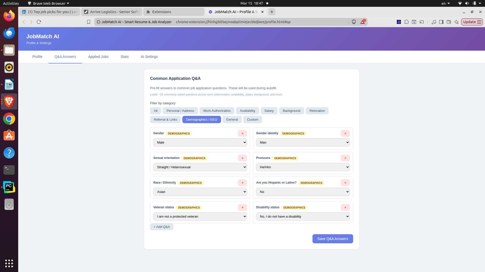
</p>
<p align="center"><em>Q&A Answers tab — pre-configured responses with category filtering. Click "Load Common US Job Application Questions" to populate everything at once.</em></p>

### Applied Jobs Tracker

Mark any job as Applied directly from the side panel. Every tracked application is stored with the match score, job title (linked to the original posting), company, location, salary, and date applied.

<p align="center">
  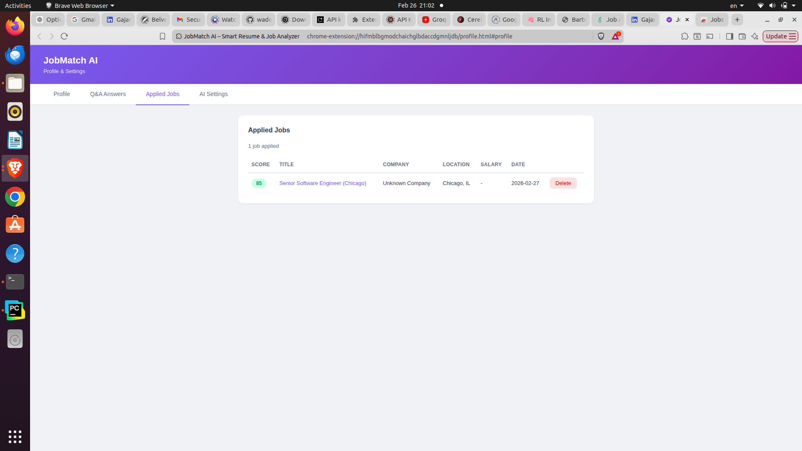
</p>
<p align="center"><em>Applied Jobs tab — full application history with match score, company, location, salary, and date. Click the job title to go back to the original posting.</em></p>

### Job Search Stats

The Stats tab gives you an overview of your search: total jobs analyzed, total applied, average match score, score distribution, and a ranked list of the skills appearing most often in jobs where you had gaps.

<p align="center">
  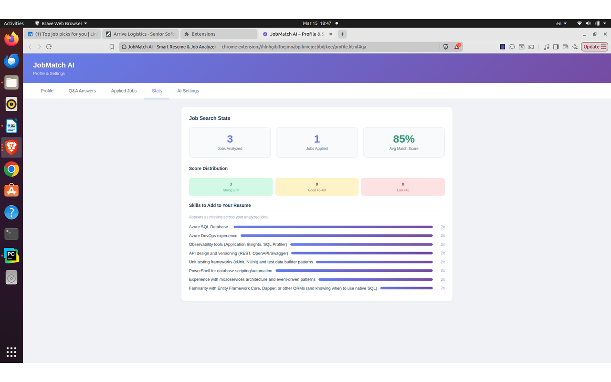
</p>
<p align="center"><em>Stats tab — jobs analyzed, applied, average match score, score distribution chart, and top skills to add to your resume across all analyzed jobs.</em></p>

### Saved Jobs

Bookmark any job from the side panel. The Saved tab shows score badges, company names, and quick links back to each posting.

### Draggable Floating Button

The **★ button** that opens the side panel can be dragged anywhere on the screen. Its position is saved and restored across page navigations, so it stays where you left it.

### Three Themes

Switch between **Ocean Blue** (light), **Dark Mode**, and **Warm Amber** using the theme toggle (☀️ 🌙 🌻) in the panel header or profile page. Your preference is saved automatically.

---

## Where It Works

JobMatch AI works on any website with a job posting. It has dedicated extraction and auto-fill support for the most widely used platforms:

| Site | JD Extraction | Salary | Location | Auto-Fill |
|------|:---:|:---:|:---:|:---:|
| LinkedIn | ✓ | ✓ | ✓ | ✓ |
| Indeed | ✓ | ✓ | ✓ | ✓ |
| Glassdoor | ✓ | ✓ | ✓ | ✓ |
| Greenhouse | ✓ | ✓ | ✓ | ✓ |
| Lever | ✓ | ✓ | ✓ | ✓ |
| Workday | ✓ | ✓ | ✓ | ✓ |
| Any other site | ✓* | ✓* | ✓* | ✓ |

\* *Uses universal selectors and regex fallbacks on sites without dedicated support.*

On SPAs like LinkedIn and Indeed, the extension detects navigation between job postings and resets the panel state automatically — no page reload needed.

---

## AI Providers — Your Key, Your Data

JobMatch AI uses your own AI API key and calls your chosen provider directly from the browser. Nothing passes through any external server. Your resume, your answers, and your API key are stored locally in Chrome's storage.

<p align="center">
  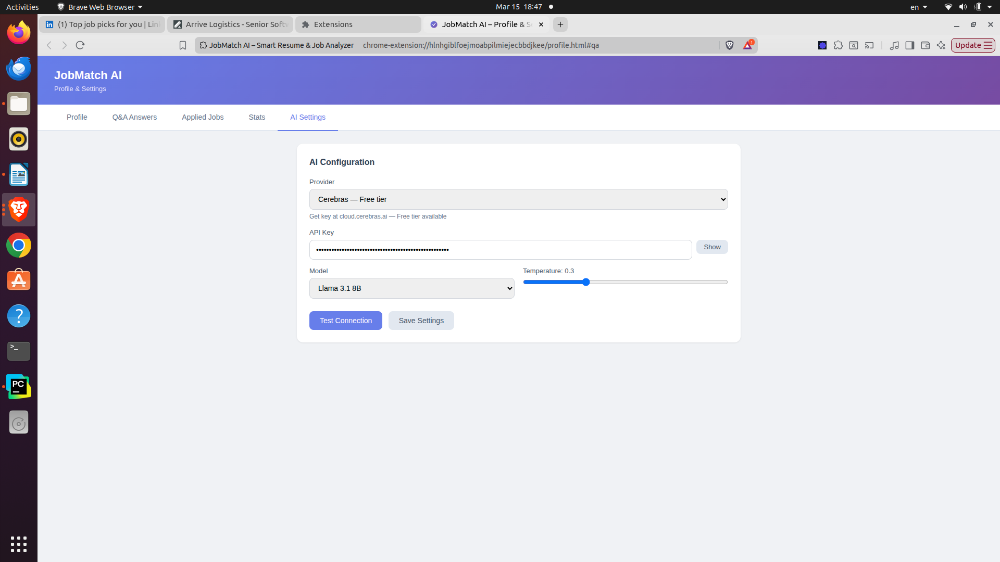
</p>
<p align="center"><em>AI Settings — select provider, paste API key, pick a model, set temperature, and click Test Connection to verify before saving.</em></p>

Supported providers — several with free tiers:

| Provider | Free Tier | Get Key |
|----------|:---------:|---------|
| **Cerebras** | ✓ | [cloud.cerebras.ai](https://cloud.cerebras.ai) |
| **Groq** | ✓ | [console.groq.com](https://console.groq.com) |
| **Google Gemini** | ✓ | [aistudio.google.com/apikey](https://aistudio.google.com/apikey) |
| **OpenRouter** | ✓ | [openrouter.ai](https://openrouter.ai) |
| **Mistral AI** | ✓ | [console.mistral.ai](https://console.mistral.ai) |
| **Together AI** | ✓ | [api.together.ai](https://api.together.ai) |
| **Cohere** | ✓ | [dashboard.cohere.com](https://dashboard.cohere.com) |
| Anthropic (Claude) | — | [console.anthropic.com](https://console.anthropic.com) |
| OpenAI | — | [platform.openai.com/api-keys](https://platform.openai.com/api-keys) |
| DeepSeek | — | [platform.deepseek.com](https://platform.deepseek.com) |

**Tip:** Cerebras, Groq, and Google Gemini have the most generous free tiers. OpenRouter gives access to dozens of free models through a single key.

### Getting a Free Key (Cerebras Example)

1. Go to [cloud.cerebras.ai](https://cloud.cerebras.ai) and sign up
2. Go to **API Keys** in the dashboard
3. Click **Create API Key**, copy it (starts with `csk-...`)
4. Paste it into JobMatch AI's **AI Settings** tab — done

The same process applies to every provider: **sign up → find API Keys → create → paste into the extension**.

---

## Getting Started

### 1. Install and Open

Install from the [Chrome Web Store](https://chromewebstore.google.com/detail/jobmatch-ai-%E2%80%93-smart-resum/pfdlaofmcbmjnljfiembdcadcjjnlcia?hl=en-US), then click the toolbar icon to open the side panel. You can also click the ★ floating button that appears on any job page.

### 2. Configure AI

Go to **AI Settings**, select a provider, paste your API key, pick a model, and click **Test Connection**. Click **Save Settings**.

### 3. Upload Your Resume

Go to **Profile**, select a slot (Resume 1, 2, or 3), and drag & drop your PDF or DOCX. The AI parses it into a structured profile — name, contact info, summary, skills, experience, education, projects, and certifications — all editable. The profile autosaves as you type.

### 4. Pre-fill Q&A (Optional)

Go to **Q&A Answers** and click **Load Common US Job Application Questions** to populate standard answers for work authorization, salary, availability, EEO fields, and more. Edit any answer to match your preferences.

### 5. Analyze a Job

Navigate to any job posting and click the **★ button** to open the panel. Click **Analyze Job**. Your match score, insights, skill gaps, ATS keywords, and recommendations are ready in seconds.

---

## Privacy

- Resume data and API keys are stored **locally** in Chrome's storage — never sent to any server other than the AI provider you configured.
- All AI analysis is performed via direct API calls from your browser to your chosen provider.
- No analytics, no tracking, no data collection of any kind.

Full privacy policy: [wadekarg.github.io/JobMatchAI/docs/privacy-policy.html](https://wadekarg.github.io/JobMatchAI/docs/privacy-policy.html)

---

## Installation (Developer / Local)

1. Clone the repository:
   ```bash
   git clone https://github.com/wadekarg/JobMatchAI.git
   ```
2. Open Chrome and go to `chrome://extensions`
3. Enable **Developer mode** (toggle in the top-right)
4. Click **Load unpacked** and select the `JobMatchAI` folder
5. Pin the extension from the puzzle icon in the Chrome toolbar

---

## Project Structure

```
JobMatchAI/
├── manifest.json            # Chrome MV3 manifest
├── background.js            # Service worker: message routing, AI calls, caching
├── content.js               # Side panel UI, job scraping, autofill, notes, badges
├── aiService.js             # AI provider abstraction (10 providers, retry logic)
├── deterministicMatcher.js  # Rule-based dropdown matching (no AI)
├── directFill.js            # Low-level field filling helpers
├── profile.html / profile.js # Profile, Q&A, Applied Jobs, Stats, AI Settings
├── styles.css               # Content script base styles
├── icons/                   # Extension icons (16, 48, 128px)
├── libs/                    # pdf.js & mammoth.js for client-side resume parsing
└── screenshots/             # README images
```

---

## Contributing

JobMatch AI is free and open source — built to help job seekers spend less time on repetitive tasks and more time landing the right role. Contributions are welcome.

1. Fork the repo
2. Create a feature branch (`git checkout -b feature/my-improvement`)
3. Commit your changes and open a Pull Request

Have an idea but not sure where to start? Open an [issue](https://github.com/wadekarg/JobMatchAI/issues).

---

## License

MIT
