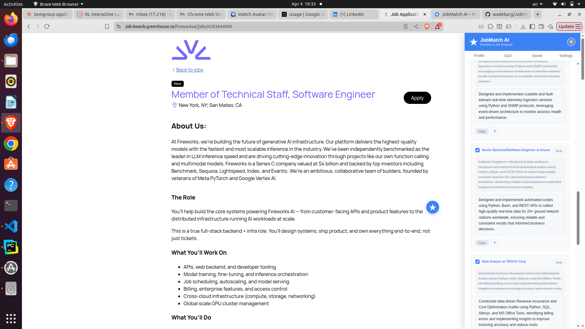
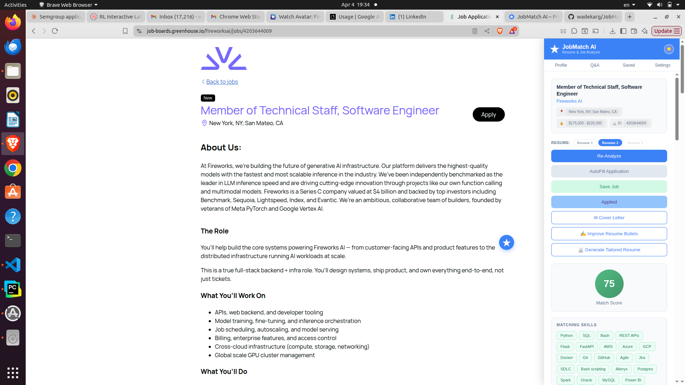
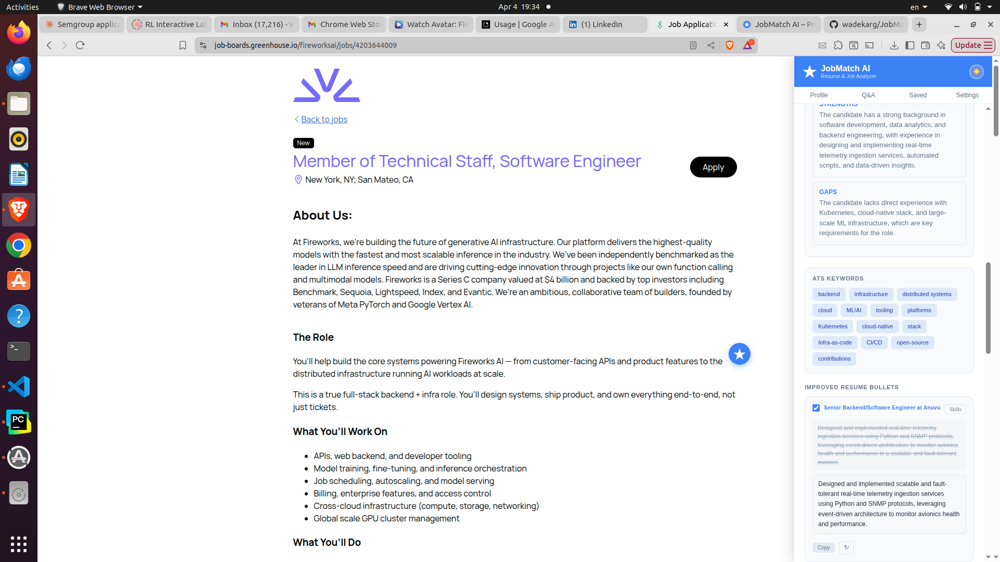
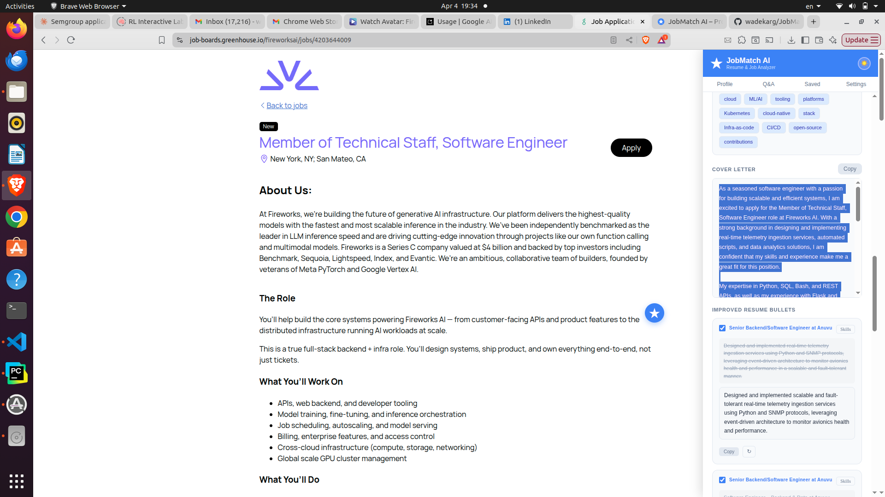
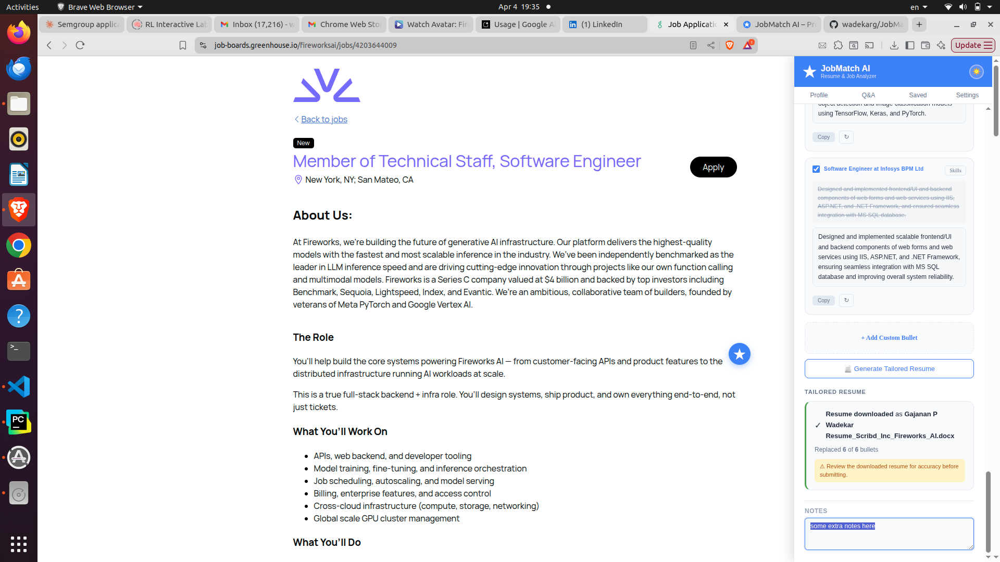

# JobMatch AI

**Smart Chrome Extension for Job Seekers** — Analyze any job posting against your resume, get a match score and skill gap analysis, auto-fill applications, generate cover letters, rewrite and tailor resume bullets, and track every job you apply to.

[](https://chromewebstore.google.com/detail/jobmatch-ai-%E2%80%93-smart-resum/pfdlaofmcbmjnljfiembdcadcjjnlcia?hl=en-US)


<p align="center">
  
</p>
<p align="center"><em>JobMatch AI panel open on a job posting — resume slot switcher, one-click Analyze, AutoFill, Cover Letter, Improve Resume Bullets, and more.</em></p>

---

## Features

### Job Match Score & Skill Analysis

Upload your resume once. Navigate to any job posting, open the panel, and click **Analyze Job** to get a full breakdown in seconds.

<p align="center">
  
</p>
<p align="center"><em>Analysis results — match score with color indicator, matching skills you already have, missing skills to address, and action buttons for every next step.</em></p>

- **Match Score (0–100)** — color-coded indicator so you can tell at a glance whether a role is worth pursuing
- **Matching Skills** — skills from your resume that the job requires
- **Missing Skills** — gaps between your profile and the job description
- **Insights** — a written strengths and gaps summary: what makes you a strong candidate and what to address before applying
- **ATS Keywords** — key terms the applicant tracking system is scanning for
- **Recommendations** — specific, actionable advice to improve your fit for that exact role

Results are cached per URL. You get a consistent score every session — click **Re-Analyze** any time to force a fresh evaluation.

---

### Recommendations & ATS Keywords

<p align="center">
  
</p>
<p align="center"><em>Recommendations with specific advice on how to strengthen your application, followed by the ATS keyword chips to incorporate into your resume and cover letter.</em></p>

---

### Smart Auto-Fill

Click **AutoFill Application** and the extension scans every field on the page, sends them to the AI along with your resume profile and pre-saved Q&A answers, and prepares an answer for every field.

A **Review before fill** panel then appears in the side panel listing every proposed answer with a checkbox. Uncheck anything you don't want filled, then click **Apply Selected** to commit — or **Cancel** to discard. Nothing is written to the form until you click Apply.

<p align="center">
  
</p>
<p align="center"><em>AutoFill in action — form fields completed using your resume and saved Q&A answers. Teal "✦ Autofilled by JobMatch AI" badges mark every filled field after you confirm.</em></p>

Works with:
- Standard text inputs and textareas
- Native `<select>` dropdowns
- Custom dropdowns built with React, Angular, or plain JS
- Radio buttons and checkboxes

Sensitive fields (CSRF tokens, tracking IDs, reCAPTCHA, framework internals) are filtered out automatically — they're never sent to the AI and never written to.

Always review filled fields one more time before submitting.

---

### Cover Letter Generator

After analyzing a job, click **Cover Letter** in the panel. A tailored letter is generated from the job description and your resume — written specifically for that role and your background, not a generic template.

<p align="center">
  
</p>
<p align="center"><em>Cover letter generated from your resume and the job description — copy it straight from the panel. Resume bullet cards are visible below for the next step.</em></p>

---

### Resume Bullet Rewriter & Tailored Resume

Click **Improve Resume Bullets** after analyzing a job. The AI rewrites every bullet in your experience section to match the job's language and incorporate the missing skills from your analysis.

<p align="center">
  
</p>
<p align="center"><em>Bullet rewriter with improved bullets, Add a Bullet area, and the Generate Tailored Resume button. The downloaded file name is shown once the DOCX is ready.</em></p>

Each bullet card gives you full control before generating:

- **Edit the improved text directly** — the rewritten bullet is a live editable field. Whatever you type is what goes into the tailored resume.
- **Skills panel** — click the **Skills** button on any bullet to see which missing skills are being woven in. Click individual skill chips to exclude skills you don't want added to that bullet.
- **Regenerate (↻)** — rewrites just that one bullet using only the skills currently selected for it. Regenerate as many times as you like.
- **Include / exclude toggle** — uncheck a bullet to exclude it from the tailored resume. Excluded bullets are faded with strikethrough so you can see exactly what's in and out.
- **Add a custom bullet** — write a new bullet from scratch at the bottom of the list and assign it to a specific experience section. It will be inserted into the tailored resume alongside the rewritten ones.

**Generate Tailored Resume** — once you're satisfied, click the button. The extension:

1. Takes every **checked** bullet — rewritten and custom
2. Replaces the original text in your uploaded DOCX with the improved / edited version
3. Inserts custom bullets into their target experience sections
4. Adds the job's **missing skills** to the skills section of your resume
5. Downloads the result as **`{your_resume_name}_{company}.docx`**

Your original resume file is never modified. The tailored version is always a new download.

---

### Job Notes

Every job has a **Notes** section at the bottom of the panel — a free-text area for observations, interview prep, follow-up reminders, or anything else. Notes save automatically per URL and persist across sessions.

<p align="center">
  
</p>
<p align="center"><em>Notes section — auto-saved per job URL. Visible at the bottom of the panel on every job page you've visited.</em></p>

---

### Three Resume Slots

Store up to **3 resume profiles** and switch between them with one click directly from the panel. Each slot is independently parsed and stored. Rename any slot to keep them organized — for example, "Backend Eng", "Data Eng", "Lead".

<p align="center">
  
</p>
<p align="center"><em>Profile page — three named resume slots, drag-and-drop upload (PDF or DOCX), and fully parsed profile fields including contact info, summary, skills, experience, education, projects, and certifications. Autosaves as you edit.</em></p>

---

### Common Q&A Answers

Pre-fill answers to hundreds of standard application questions so AutoFill can complete them instantly. Covers work authorization, availability, salary expectations, notice period, sponsorship requirements, EEO and demographic fields, and more. Filter by category to quickly find and update any answer.

<p align="center">
  
</p>
<p align="center"><em>Q&A Answers — pre-configured responses with category filtering. Click "Load Common US Job Application Questions" to populate everything at once.</em></p>

---

### Applied Jobs Tracker

Mark any job as Applied from the panel. Every tracked application is stored with the match score, job title (linked to the original posting), company, location, salary, and date applied.

<p align="center">
  
</p>
<p align="center"><em>Applied Jobs — full application history. Click any job title to go back to the original posting.</em></p>

---

### Job Search Stats

The Stats tab gives you a live overview of your search: total jobs analyzed, total applied, average match score, score distribution, and a ranked list of the skills appearing most often in jobs where you had gaps — so you know exactly what to add to your resume next.

<p align="center">
  
</p>
<p align="center"><em>Stats — job search analytics at a glance, including the top skills to add to your resume based on all the jobs you've analyzed.</em></p>

---

### Saved Jobs

Bookmark any job from the panel. The Saved tab shows score badges, company names, and quick links back to each posting for when you're ready to apply.

---

### Draggable Floating Button

The **★ button** that opens the panel can be dragged anywhere on the screen. Its position is saved and restored across page navigations — it stays where you put it.

---

### Three Themes

Switch between **Ocean Blue** (light), **Dark Mode**, and **Warm Amber** using the theme toggle (☀️ 🌙 🌻) in the panel header or profile page. Your preference is saved automatically.

---

## Where It Works

JobMatch AI works on any website with a job posting. It has dedicated extraction and auto-fill support for the most widely used platforms:

| Site | JD Extraction | Salary | Location | Auto-Fill |
|------|:---:|:---:|:---:|:---:|
| LinkedIn | ✓ | ✓ | ✓ | ✓ |
| Indeed | ✓ | ✓ | ✓ | ✓ |
| Glassdoor | ✓ | ✓ | ✓ | ✓ |
| Greenhouse | ✓ | ✓ | ✓ | ✓ |
| Lever | ✓ | ✓ | ✓ | ✓ |
| Workday | ✓ | ✓ | ✓ | ✓ |
| Any other site | ✓* | ✓* | ✓* | ✓ |

\* *Uses universal selectors and regex fallbacks on sites without dedicated support.*

On SPAs like LinkedIn and Indeed, the extension detects navigation between job postings and resets the panel state automatically — no page reload needed.

---

## AI Providers — Your Key, Your Data

JobMatch AI uses your own AI API key and calls your chosen provider directly from the browser. Nothing passes through any external server. Your resume, your answers, and your API key are stored locally in Chrome's storage.

<p align="center">
  
</p>
<p align="center"><em>AI Settings — select a provider, paste your API key, pick a model, set temperature, and click Test Connection to verify before saving.</em></p>

Supported providers — several with free tiers:

| Provider | Free Tier | Get Key |
|----------|:---------:|---------|
| **Cerebras** | ✓ | [cloud.cerebras.ai](https://cloud.cerebras.ai) |
| **Groq** | ✓ | [console.groq.com](https://console.groq.com) |
| **Google Gemini** | ✓ | [aistudio.google.com/apikey](https://aistudio.google.com/apikey) |
| **OpenRouter** | ✓ | [openrouter.ai](https://openrouter.ai) |
| **Mistral AI** | ✓ | [console.mistral.ai](https://console.mistral.ai) |
| **Together AI** | ✓ | [api.together.ai](https://api.together.ai) |
| **Cohere** | ✓ | [dashboard.cohere.com](https://dashboard.cohere.com) |
| Anthropic (Claude) | — | [console.anthropic.com](https://console.anthropic.com) |
| OpenAI | — | [platform.openai.com/api-keys](https://platform.openai.com/api-keys) |
| DeepSeek | — | [platform.deepseek.com](https://platform.deepseek.com) |

**Tip:** Cerebras, Groq, and Google Gemini have the most generous free tiers. OpenRouter gives access to dozens of free models through a single key.

### Getting a Free Key (Cerebras Example)

1. Go to [cloud.cerebras.ai](https://cloud.cerebras.ai) and sign up
2. Go to **API Keys** in the dashboard
3. Click **Create API Key** and copy it (starts with `csk-...`)
4. Paste it into JobMatch AI's **AI Settings** tab — done

The same flow applies to every provider: sign up → find API Keys → create → paste into the extension.

---

## Getting Started

### 1. Install and Open

Install from the [Chrome Web Store](https://chromewebstore.google.com/detail/jobmatch-ai-%E2%80%93-smart-resum/pfdlaofmcbmjnljfiembdcadcjjnlcia?hl=en-US), then click the toolbar icon or the **★ floating button** on any job page to open the panel.

### 2. Configure AI

Go to **AI Settings**, select a provider, paste your API key, pick a model, and click **Test Connection**. Click **Save Settings**.

### 3. Upload Your Resume

Go to **Profile**, select a slot (Resume 1, 2, or 3), and drag & drop your PDF or DOCX. The AI parses it into a structured profile — name, contact info, summary, skills, experience, education, projects, and certifications — all editable. The profile autosaves as you type.

### 4. Pre-fill Q&A (Optional but Recommended)

Go to **Q&A Answers** and click **Load Common US Job Application Questions** to populate standard answers for work authorization, salary, availability, EEO fields, and more. Edit any answer to match your preferences.

### 5. Analyze a Job

Navigate to any job posting, click the **★ button** to open the panel, and click **Analyze Job**. Your match score, insights, skill gaps, ATS keywords, and recommendations are ready in seconds.

### 6. Apply

- Use **AutoFill Application** to complete the form with your resume and Q&A answers
- Generate a **Cover Letter** tailored to the role
- **Improve Resume Bullets** and download a **Tailored Resume** with missing skills added
- Click **Mark as Applied** to log the application

---

## Privacy

- Your resume and API keys are stored **locally** in Chrome's storage — never sent to any server other than the AI provider you configured.
- All AI analysis happens via direct API calls from your browser to your chosen provider.
- No analytics, no tracking, no data collection of any kind.

Full privacy policy: [wadekarg.github.io/JobMatchAI/docs/privacy-policy.html](https://wadekarg.github.io/JobMatchAI/docs/privacy-policy.html)

---

## Installation (Developer / Local Build)

1. Clone the repository:
   ```bash
   git clone https://github.com/wadekarg/JobMatchAI.git
   ```
2. Open Chrome and go to `chrome://extensions`
3. Enable **Developer mode** (toggle in the top-right)
4. Click **Load unpacked** and select the `JobMatchAI` folder
5. Pin the extension from the puzzle icon in the Chrome toolbar

---

## Project Structure

```
JobMatchAI/
├── manifest.json            # Chrome MV3 manifest
├── background.js            # Service worker: message routing, AI calls, caching
├── content.js               # Side panel UI, job scraping, autofill, notes, badges
├── aiService.js             # AI provider abstraction (10 providers, retry logic)
├── deterministicMatcher.js  # Rule-based dropdown matching (no AI)
├── directFill.js            # Low-level field filling helpers
├── profile.html / profile.js # Profile, Q&A, Applied Jobs, Stats, AI Settings
├── styles.css               # Content script base styles
├── icons/                   # Extension icons (16, 48, 128px)
├── libs/                    # pdf.js & mammoth.js for client-side resume parsing
└── screenshots/             # README images
```

---

## Contributing

JobMatch AI is free and open source — built to help job seekers spend less time on repetitive tasks and more time landing the right role. Contributions are welcome.

1. Fork the repo
2. Create a feature branch: `git checkout -b feature/my-improvement`
3. Commit your changes and open a Pull Request

Have an idea but not sure where to start? Open an [issue](https://github.com/wadekarg/JobMatchAI/issues).

---

## License

MIT
