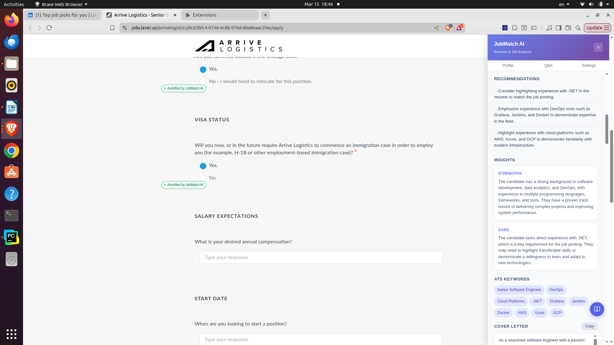

# JobMatch AI

**Smart Chrome Extension for Job Seekers** — Analyze job postings against your resume using AI, get match scores, auto-fill applications, generate cover letters, rewrite resume bullets, and track every job you apply to.


<p align="center">
  
</p>
<p align="center"><em>JobMatch AI open on a LinkedIn Easy Apply form — showing match score 85, matching skills, and the AutoFill Application button. Teal "Autofilled by JobMatch AI" badges appear next to each filled field.</em></p>

---

## Features

### Resume Analysis & Job Matching

Upload your resume (PDF or DOCX) and let AI parse it into a structured profile. When you visit any job posting, click **Analyze Job** to get:
- **Match Score** (0–100) with color-coded indicator
- **Matching Skills** — what you already have
- **Missing Skills** — gaps to address
- **Recommendations** — actionable advice to improve your fit
- **ATS Keywords** — key terms to include in your application

<p align="center">
  
</p>
<p align="center"><em>Recommendations panel — personalized suggestions on how to strengthen your application. Teal badges next to filled fields confirm what JobMatch AI auto-completed.</em></p>

### Smart Auto-Fill

Click **AutoFill Application** and the extension scans the form, sends fields to AI, and fills everything instantly — using your resume profile and pre-configured Q&A answers. Works with:
- Text inputs and textareas
- Native `<select>` dropdowns
- Custom dropdowns (React, Angular, etc.)
- Radio buttons and checkboxes

Every filled field gets a **"✦ Autofilled by JobMatch AI"** teal badge so you know exactly what was touched before you submit.

### Cover Letter Generator

Generate a tailored cover letter from the job description and your resume profile in one click.

<p align="center">
  
</p>
<p align="center"><em>Cover letter generated from your resume and the job description — ready to copy and paste.</em></p>

### Resume Bullet Rewriter

Improve your experience bullets to better match the job's language and missing skills.

<p align="center">
  
</p>
<p align="center"><em>Improved Resume Bullets — AI rewrites your experience descriptions to highlight the skills and keywords the job is looking for.</em></p>

### Three Resume Slots

Store up to **3 different resumes** and switch between them with one click — useful for applying to different types of roles (e.g. backend, data engineering, management).

<p align="center">
  
</p>
<p align="center"><em>Profile page — three resume slots at the top, parsed resume data (name, contact info, location, LinkedIn, GitHub, professional summary) automatically extracted from your uploaded PDF or DOCX.</em></p>

### Common Q&A Answers

Pre-fill answers to hundreds of common application questions so AutoFill can complete them instantly. Includes full EEO/demographic dropdown support.

<p align="center">
  
</p>
<p align="center"><em>Q&A Answers tab — pre-configure responses for work authorization, availability, salary, demographics (EEO), and more. Filter by category to quickly find and edit any answer.</em></p>

### Applied Jobs Tracker

Mark jobs as "Applied" directly from the side panel. Review all your applications in one place.

<p align="center">
  
</p>
<p align="center"><em>Applied Jobs tab — every tracked application with match score, job title (linked to original posting), company, location, salary, and date applied.</em></p>

### Job Search Stats

See an overview of your job search progress — total jobs analyzed, applied, average match score, score distribution, and a ranked list of skills to add to your resume.

<p align="center">
  
</p>
<p align="center"><em>Stats tab — job search analytics at a glance: jobs analyzed, applied, average match score, score distribution, and the top skills missing from your resume across all analyzed jobs.</em></p>

### Consistent, Cached Scores

Analysis results are cached per URL with deterministic AI settings (temperature=0), so you get the same score every time for the same job. Click **Re-Analyze** to force a fresh evaluation.

---

## Installation

1. **Clone** this repository:
   ```bash
   git clone https://github.com/wadekarg/JobMatchAI.git
   ```

2. Open Chrome (or any Chromium browser) and go to `chrome://extensions`

3. Enable **Developer mode** (toggle in the top-right corner)

4. Click **Load unpacked** and select the `JobMatchAI` folder

5. Pin the extension from the puzzle icon in Chrome's toolbar for easy access

---

## Prerequisites — You Need an AI API Key

JobMatch AI uses generative AI to analyze resumes and job postings. **You'll need a free or paid API key** from any supported provider.

### Supported AI Providers

| Provider | Free Tier | Get API Key |
|----------|:---------:|-------------|
| **Cerebras** | Yes | [cloud.cerebras.ai](https://cloud.cerebras.ai) |
| **Groq** | Yes | [console.groq.com](https://console.groq.com) |
| **Google Gemini** | Yes | [aistudio.google.com/apikey](https://aistudio.google.com/apikey) |
| **OpenRouter** | Yes | [openrouter.ai](https://openrouter.ai) |
| **Mistral AI** | Yes | [console.mistral.ai](https://console.mistral.ai) |
| **Together AI** | Yes | [api.together.ai](https://api.together.ai) |
| **Cohere** | Yes | [dashboard.cohere.com](https://dashboard.cohere.com) |
| Anthropic (Claude) | No | [console.anthropic.com](https://console.anthropic.com) |
| OpenAI | No | [platform.openai.com/api-keys](https://platform.openai.com/api-keys) |
| DeepSeek | No | [platform.deepseek.com](https://platform.deepseek.com) |

### How to Get a Free API Key (Cerebras Example)

1. Go to [cloud.cerebras.ai](https://cloud.cerebras.ai) and sign up (Google or GitHub login works)
2. Once logged in, go to **API Keys** in the dashboard
3. Click **Create API Key**, give it a name, and copy the key (starts with `csk-...`)
4. Paste it into JobMatch AI's **AI Settings** page — done!

The same process applies to all providers: **sign up → find API Keys in dashboard → create key → copy and paste into the extension**.

> **Tip:** Cerebras, Groq, and Google Gemini offer the most generous free tiers. OpenRouter gives access to multiple free models through a single key.

---

## Getting Started

### 1. Configure AI Provider

<p align="center">
  
</p>
<p align="center"><em>AI Settings — select your provider, paste your API key, pick a model, adjust temperature, and hit Test Connection to verify before saving.</em></p>

Click the extension icon → **AI Settings** tab (or open the side panel → Settings link).

- Select your AI provider
- Enter your API key
- Choose a model
- Click **Test Connection** to verify
- Click **Save Settings**

### 2. Upload Your Resume

Go to the **Profile** tab, select a resume slot (Resume 1, 2, or 3), then drag & drop your resume (PDF or DOCX). AI will parse it into structured fields you can review and edit.

### 3. Pre-fill Q&A Answers (Optional)

Go to the **Q&A Answers** tab and click **Load Common US Job Application Questions** to pre-fill answers for work authorization, availability, salary expectations, demographics (EEO), and more.

---

## Usage

### Analyzing a Job Posting

1. Navigate to any job posting (LinkedIn, Indeed, Greenhouse, Lever, etc.)
2. Click the **★ button** (bottom-right corner of the page) to open the side panel
3. Click **Analyze Job**
4. Review your match score, skill gaps, recommendations, and ATS keywords
5. Click **Save Job** to bookmark it, or **Mark as Applied** to track it

### Auto-Filling Applications

1. Navigate to a job application form
2. Open the side panel and click **AutoFill Application**
3. The extension scans the form, sends fields to AI, and fills everything instantly
4. Teal **"Autofilled by JobMatch AI"** badges appear next to each filled field
5. **Always review** the filled fields before submitting

### Generating a Cover Letter

After analyzing a job, click **Cover Letter** in the side panel. A tailored cover letter is generated from your resume and the job description. Click **Copy** to copy it to your clipboard.

### Rewriting Resume Bullets

After analyzing a job, click **Improve Resume Bullets** in the side panel. The AI rewrites your experience bullets to better match the job's language and fill skill gaps.

### Tracking Applied Jobs

1. After analyzing a job, click **Mark as Applied** in the side panel
2. Open **Profile → Applied Jobs** tab to see all your applications
3. Each entry shows match score, job title (linked to posting), company, location, salary, and date
4. Click **Delete** to remove any entry

---

## Supported Job Sites

| Site | JD Extraction | Salary | Location | Auto-Fill |
|------|:---:|:---:|:---:|:---:|
| LinkedIn | ✓ | ✓ | ✓ | ✓ |
| Indeed | ✓ | ✓ | ✓ | ✓ |
| Glassdoor | ✓ | ✓ | ✓ | ✓ |
| Greenhouse | ✓ | ✓ | ✓ | ✓ |
| Lever | ✓ | ✓ | ✓ | ✓ |
| Workday | ✓ | ✓ | ✓ | ✓ |
| Generic sites | ✓* | ✓* | ✓* | ✓ |

\* *Uses generic selectors and regex fallbacks for sites without dedicated support.*

---

## Project Structure

```
JobMatchAI/
├── manifest.json            # Chrome MV3 manifest
├── background.js            # Service worker: message routing, AI calls, storage
├── content.js               # Side panel UI, job scraping, autofill, badges
├── aiService.js             # AI provider abstraction (API calls, prompt builders)
├── deterministicMatcher.js  # Rule-based dropdown matching (no AI needed)
├── popup.html / popup.js    # Extension toolbar popup
├── profile.html / profile.js # Profile, Q&A, Applied Jobs, Stats, Settings page
├── styles.css               # Content script base styles
├── icons/                   # Extension icons (16, 48, 128px)
├── libs/                    # pdf.js & mammoth.js for client-side resume parsing
└── screenshots/             # README images
```

---

## Privacy

- Your resume data and API keys are stored **locally** in Chrome's storage — nothing is sent to any server except the AI provider you configure.
- Job analysis is performed via direct API calls to your chosen AI provider.
- No analytics, no tracking, no data collection.

---

## Contributing

JobMatch AI is **free and open source** — built to help job seekers spend less time on repetitive tasks and more time landing the right role. Contributions are welcome.

1. Fork the repo
2. Create a feature branch (`git checkout -b feature/my-improvement`)
3. Commit your changes
4. Push to the branch and open a Pull Request

If you have ideas but aren't sure where to start, open an [issue](https://github.com/wadekarg/JobMatchAI/issues).

---

## License

MIT
